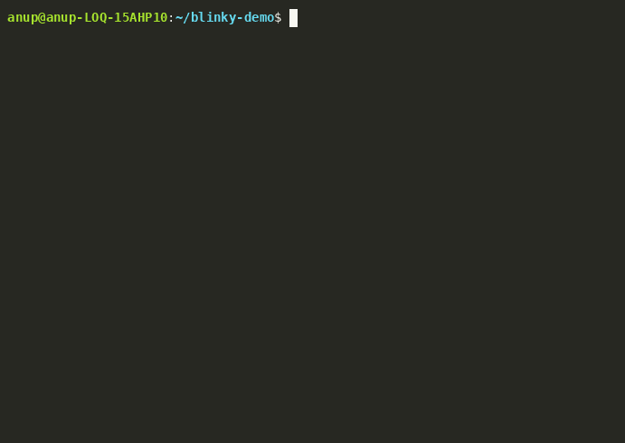

# stm32-substrate

**STM32 development, by talking to Claude.**

STM32 is one of the most widely used 32-bit microcontroller families in the
world. ST ships a strong, free toolchain for it — CubeMX to configure a chip,
CubeIDE to build and debug, CubeProgrammer to flash it, and a handful more. The
tools are capable, but they're a lot to learn, they don't talk to each other,
and none was built to be driven by an AI coding agent.

This plugin changes that. It lets you do STM32 development by talking to Claude
Code in plain language — *"build my project," "flash it to the board," "why is
it crashing?"* Claude calls ST's tools for you and reports back. You stop
juggling six separate applications and just describe what you want done.

**The promise: once it's installed, you don't have to remember anything about
it.** No flags to memorize, no syntax to keep in your head. The five slash
commands are there for when you'd rather point at a tool directly — but most of
the time you just talk.

## Demo



*Real session, real hardware: a NUCLEO-L476RG (Cortex-M4), built and flashed
end-to-end from one sentence — first try.*

The same request in text, plus two more shapes of what a session looks like:

**Build & flash:**

> **You:** build my project and flash it to my nucleo
> **Claude:** *(runs `stm32 build ~/blinky-demo` — resolves the nested CubeIDE
> project, builds Debug)*
> Build: 0 errors, 0 warnings — `BLINKY.elf`, ~5.7 KB flash.
> *(runs `stm32 prog flash …/Debug/BLINKY.elf`)*
> Flashed in ~0.3 s, address taken from the ELF. The LED should be blinking now.

**Diagnose a crash:**

> **You:** my board keeps crashing — memory bug or interrupt problem?
> **Claude:** *(runs `stm32 debug read-peripheral SCB`, `read-peripheral NVIC`,
> `decode-hardfault`, `callstack`)*
> Neither — every fault register is zero (`CFSR=0`, `HFSR=0`) and no IRQs are
> enabled yet. You're looking at the *next* boot, not the crash: the MCU was
> reset mid-fault — most likely a watchdog, or an `NVIC_SystemReset()` inside a
> fault handler. Let's catch it live: I'll break in the fault handler before the
> reset fires.

**Read a register:**

> **You:** what's RCC->CR right now?
> **Claude:** *(runs `stm32 debug read-peripheral RCC` — gdbserver attach, SVD
> decode, detach)*
> `CR = 0x00000063`: `MSION=1, MSIRDY=1`, PLL off — the core is on the 4 MHz
> MSI reset default, which means your clock configuration never ran.

What just happened in all three: the substrate ran ST's own CLIs and captured
their output; Claude read it and decided the next step. No magic, no parsing of
vendor prose — the same tools you already trust, driven conversationally.

## What Claude can do for you

**You ask, Claude does:**

- **Configure** a chip and generate project code (STM32CubeMX)
- **Build** firmware (STM32CubeIDE)
- **Flash, erase, read, and verify** device memory (STM32CubeProgrammer)
- **Sign** secure binaries for the chips that require it (STM32 Signing Tool)

**Claude reaches for these on its own:**

- **Read firmware state over the debugger** while diagnosing a crash or working
  a fix (ST-LINK GDB server). For hands-on stepping you'll still want the
  CubeIDE GUI — this path is built for Claude to *read* what your firmware is
  doing, not to replace your debugger.
- **Read the serial port** when it needs to see what your firmware is printing,
  or confirm a board is alive (USB virtual COM port).

The substrate is family-agnostic: if ST's tools support the chip, Claude can
drive them against it — from an 8 MHz low-power part up to the latest Cortex-M85
and NPU-equipped silicon.

## Quick start

1. **Install ST's tools** — the ones you need, from [st.com](https://www.st.com/en/development-tools/stm32-software-development-tools.html): CubeProgrammer, CubeIDE, CubeMX, the ST-LINK GDB server, `arm-none-eabi-gdb`, the Signing Tool. The substrate drives them; it doesn't bundle them.
2. **Install the substrate** — the `stm32` CLI plus the Claude Code plugin, in one paste (see **Install** below).
3. **Bring a project** — an existing CubeIDE project, a CubeMX `.ioc`, or just a `.bin`/`.elf` to flash. No project yet? Generate one with `/stm32project`.
4. **Write `stm32-project.jsonc`** — point the substrate at that project (board, build, ELF, IOC). Claude can scaffold it for you (see **the one per-project step** below).
5. **Attach your board** — an ST-LINK probe and a NUCLEO/DISCO for anything that flashes, debugs, or reads the serial port.
6. **Talk** — *"build it and flash my Nucleo."* Claude runs the tools and reports back.

## Install — 30 seconds

**Requirements:** [Claude Code](https://docs.claude.com/en/docs/claude-code), [Python 3.11+](https://www.python.org/downloads/), [Git](https://git-scm.com/), and [ST's STM32 tools](https://www.st.com/en/development-tools/stm32-software-development-tools.html) — install the ones you need; the substrate drives them, it doesn't bundle them. Linux or Windows (macOS isn't supported yet). An ST-LINK probe and a board for anything that touches hardware.

### Step 1: Install on your machine

Open Claude Code and paste this. Claude does the rest.

> Install the STM32 substrate: run `pip install git+https://github.com/EmbedAgents/stm32-substrate.git` to get the `stm32` CLI, then register the plugin with `claude plugin marketplace add EmbedAgents/stm32-substrate` and `claude plugin install stm32-substrate@stm32`. Then ask me which ST tools I have installed (STM32CubeProgrammer, CubeIDE, CubeMX, the ST-LINK GDB server, arm-none-eabi-gdb, the Signing Tool) and write a `.claude/stm32-tools.local.jsonc` that points at them.

That installs the `stm32` CLI + `stm32_substrate` library and registers the five `/stm32*` slash commands. Restart Claude Code if the commands don't show up right away.

Prefer to do the plugin half by hand? Run `/plugin marketplace add EmbedAgents/stm32-substrate` then `/plugin install stm32-substrate@stm32`. And once it's on PyPI, the package step is simply `pip install stm32-substrate`.

### Step 2: Point it at your ST tools

The substrate finds each tool by **environment variable → `.claude/stm32-tools.local.jsonc` → your `PATH`**, and fails loud — naming the exact key to set — if it can't. Claude can write that file for you in Step 1; the [schema](src/stm32_substrate/schemas/stm32-tools.local.schema.json) lists every key. Set it once and you're done.

Then just talk:

> **You:** build my project and flash it to the Nucleo
> **Claude:** *(runs `stm32 build` then `stm32 prog flash …`, reports back)*

## The one per-project step you can't skip

**Do this once per project — most commands have nothing to act on until you do.**
Drop a `stm32-project.jsonc` in your project folder; it tells the substrate your
board, build, workspace, ELF, and IOC, and every command reads it. Fill it once and
you stop repeating yourself. Only `version` is strictly required.

```jsonc
{
  "version": 1,
  "project_name": "blinky",
  "board":    { "name": "NUCLEO-L476RG", "mcu": "STM32L476RG" },
  "firmware": { "board": "nucleo-l476rg", "flash_address": "0x08000000" },
  "build": {
    "project_path": "STM32CubeIDE",
    "workspace": ".stm32-substrate-workspace",
    "default_configuration": "Debug",
    "artifact": "Debug/blinky.elf"
  },
  "debug":  { "elf_path": "STM32CubeIDE/Debug/blinky.elf" },
  "cubemx": { "ioc_path": "blinky.ioc" }
}
```

`build.workspace` is the Eclipse workspace CubeIDE uses for headless builds (defaults
to `<repo>/.stm32-substrate-workspace/` if omitted). Don't want to hand-write it? Ask
Claude to scaffold one, or run a command in the folder and it'll offer.

### How you tell a command which project or file to use

1. **You name it** — attach a file, or put a path in your request.
2. **The folder's `stm32-project.jsonc`** — in the folder you name, or the one Claude
   is running in.
3. **Otherwise it stops and asks you**, with a template to fill — it never scans and
   guesses (no "pick the only `.elf`").

A specific ELF or IOC follows the same order: **your explicit arg → the descriptor
field** (`debug.elf_path`, `cubemx.ioc_path`, `build.artifact`) **→ a loud error**.

*(Vendor-tool paths resolve separately — see Step 2. Device, board, and peripheral
names in your prompts are illustrative; ground truth is CubeMX's database and the SVD
files.)*

## Usage

You mostly just talk, like in Step 1 — *"flash the build to my Nucleo and reset
it"* and Claude runs the tools. The five slash commands stay available when
you'd rather point at one directly:

| Command | What it does | ST tool behind it |
|---|---|---|
| `/stm32project` | Configure a chip and generate project code | STM32CubeMX |
| `/stm32build` | Build your firmware | STM32CubeIDE |
| `/stm32prog` | Flash, erase, read/verify memory, sign secure binaries | STM32CubeProgrammer + Signing Tool |
| `/stm32debug` | Read firmware state over the debugger during a fix | ST-LINK GDB server |
| `/stm32agent` | Read the serial port and run cross-tool flows | VCP reader |

Each surface — the library, the `stm32` CLI, and the slash commands — maps to
the same operations, so anything you can ask for in chat you can also script.

### As a Python library

```python
from stm32_substrate.context import SubstrateContext
from stm32_substrate.cubeprogrammer import CubeProgrammer

ctx = SubstrateContext.from_environment()
prog = CubeProgrammer(ctx)
banner = prog.connect()
print(banner.device_name, banner.flash_size_kb)
```

## Safety

Destructive operations are gated, not silent. Mass erase, flashing a `.bin` to
an inferred address, and option-byte / RDP writes all require an explicit
confirmation (`confirm_destructive=True` in the library, a `--confirm-…` flag on
the CLI). The substrate captures tool output and outcomes — it doesn't
second-guess them — and surfaces failures as structured errors with an
actionable hint rather than a raw traceback.

## Uninstall

Remove the plugin and the package — nothing else is left behind.

```bash
# Remove the Claude Code plugin + its marketplace entry
claude plugin uninstall stm32-substrate
claude plugin marketplace remove stm32

# Uninstall the Python package / `stm32` CLI
pip uninstall stm32-substrate
```

If you created one, delete your `.claude/stm32-tools.local.jsonc`. The substrate
leaves nothing else on your machine — no caches, no dotfiles, no daemons.

## Troubleshooting

- **`ConfigurationError: … not found`** — the substrate couldn't locate a tool.
  The error names the exact env var / JSON key to set. Point it at the tool in
  `.claude/stm32-tools.local.jsonc`, or export the named variable (e.g.
  `STM32_PROGRAMMER_CLI`).
- **The `/stm32*` commands don't show up** — restart Claude Code, then check
  `claude plugin list`. Re-run Step 1 if the plugin isn't listed.
- **`macOS is not supported`** — v1 runs on Linux and Windows only; macOS is
  planned based on demand.
- **Probe not found / target-connect errors** — check the ST-LINK cable and board
  power, and make sure nothing else holds the probe. Only one debug client can own
  the SWD probe at a time, so close the CubeIDE GUI debugger or any other running
  gdbserver first.
- **A destructive operation was refused** — that's the safety gate working. Re-run
  with `confirm_destructive=True` (library) or the matching `--confirm-…` flag
  (CLI).
- **Schema validation failed at startup** — fix the reported field in your config.
  For a one-off debug bypass, set `STM32_SUBSTRATE_SKIP_SCHEMA_VALIDATION=1` (it
  warns loudly).

## Privacy & Telemetry

**Nothing is sent anywhere, ever.** The substrate has no telemetry, no analytics,
no crash reporting, no usage tracking, and no phone-home — none. It makes no
network calls at all.

It runs entirely on your machine: it shells out to ST's local vendor CLIs and
reads your serial port, and that's the whole story. No account and no API key are
needed to use it. Its only dependencies are `jsonschema` and `pyserial`, neither
of which contacts a server.

The only things that ever touch the network are tools you already run and control
— ST's own installers (when *you* download them) and Claude Code itself (your
conversation with Claude, under Anthropic's terms). The substrate adds zero
network surface of its own.

## License

[MIT](LICENSE) © 2026 EmbedAgents

## Disclaimer

This project is an independent, community-driven tool and is not an official
release by STMicroelectronics. STM32 is a registered trademark of
STMicroelectronics International N.V. This software is provided free of charge
for educational and development purposes, and its use of the trademark is
strictly descriptive to help developers identify hardware compatibility.
